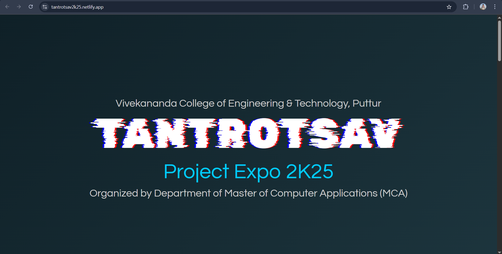

# Tantrotsav Project Expo 2k25

**Live Website:** [Visit Here](https://tantrotsav2k25.netlify.app/)

## 📌 About the Project

**Tantrotsav 2k25** is the official website created for the **Project Expo 2025**, organized by the **Department of MCA, VCET, Puttur**. This platform highlights the essence of innovation, creativity, and technological excellence demonstrated by students during the event.

The website serves as a digital portal to:
- Showcase innovative student projects
- Provide event details and schedules
- Present information about the college and the MCA department
- Celebrate the spirit of technical exploration and creativity

## 🌐 Technologies Used

- **HTML5** – For structuring the content
- **CSS3** – For styling the website and ensuring responsive design
- **JavaScript** – For adding interactivity and smooth user experience

## 🚀 Features

- Fully responsive layout
- Smooth navigation
- Interactive sections for projects and event details
- Clear presentation of institutional and departmental information

## 🏫 Organized By

**Department of Master of Computer Applications (MCA)**  
**Vivekananda College of Engineering and Technology (VCET), Puttur**

## 📸 Preview

 <!-- Replace with an actual screenshot link if available -->

## 💡 Future Enhancements

- Admin panel for project submission and approval
- Search and filter features for projects
- Project voting and feedback system
- Gallery and highlights section for past events

## 📬 Contact

For any queries or contributions, feel free to reach out via [anirudhabg@gmail.com](mailto:anirudhabg@gmail.com)

---

> Made with ❤️ by Anirudha B G Somayaji
